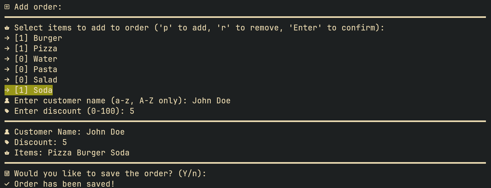

# Restaurant Order Management

## Description

The **Restaurant Order Management** application is designed to handle restaurant orders, providing CRUD operations functionality.

This is a console/shell-based application, which can be launched using the command `java -jar OrderManager.jar` from the `/bin` directory. It is intended for use on a **Linux (Desktop Environment)** operating system with a [Nerd Fonts](https://www.nerdfonts.com/) font installed, having been developed and tested on such a system. The minimum required Java version to run the application is 23.

Documentation is provided in English through JavaDocs and can be found [here](./JavaDocs/index.html). The documentation covers only the backend of the application.

## Features

### Main Menu

Upon opening the application, a menu with two sections is displayed. The first is for **order listing**, and the second is for **menu options**.

> If the `menu.txt` and `orders.txt` files are not present when the application opens, they will be created as follows:
>
> - `menu.txt` will contain a predefined menu, with each item having a name and price.
> - `orders.txt` will be an empty file to hold orders added by the user.

To navigate within either menu, use the `Enter` key to select an option and the `↑` and `↓` keys to move between options.

To switch to the order section, use the `Tab` key, which will move the user to the order section, where they can navigate with the `↑` and `↓` keys. Pressing `Enter` will open the selected order’s detail page.

> The active order section is indicated by a green background.

If a page contains more than 10 items, users can navigate between pages using the `←` and `→` keys.

**Available Options:**

- **View Order**: view the details of an order;
- **Add Order**: add a new order by filling out a form;
- **Sort Orders**: sort orders based on a selected criterion, as indicated by sorting icons next to each column;
- **Generate Report**: generate a report in txt format containing details about orders;
- **Exit**: exit the application and save changes.

### Viewing an Order

To view an order, the user selects the option from the main menu or presses `Enter` on an order in the list.

On the order detail page, the user can see order details and has options to edit or delete the order, along with shortcuts to quickly mark an order as *Preparing* or *Completed*.

### CRUD Operations on Orders

To **add an order**, the user selects the option from the main menu.

To **edit an order**, the user selects the edit option from the order detail page.

In both cases, the user is directed to a form where they can complete order details and submit the form to save changes.

> When adding or editing an order, the user fills in only the necessary fields; the rest are automatically completed (e.g., the order date is set to the system’s current date and time, the total is calculated based on the order’s content, and the status is set to *Pending*).
>
> The form is user-friendly, with completion instructions and real-time data validation. If invalid data is entered, the user will need to re-enter the correct data.

To **delete an order**, the user selects the delete option from the order detail page.

### Sorting Orders

To sort orders, the user selects the option from the main menu. Sorting will be indicated by icons showing the sort direction.

Sorting is available for the first three columns, with six total options:

- Date (ascending/descending);
- Status (ascending/descending);
- Total (ascending/descending).

### Generating a Report

To generate a report, the user selects the option from the main menu. The report will be generated in `.txt` format and will contain details on two important factors selected by the user:

- **Top Foods**: a sorted list of the most popular items;
- **Earnings**: a report on revenue for the last 1, 7, and 30 days.
