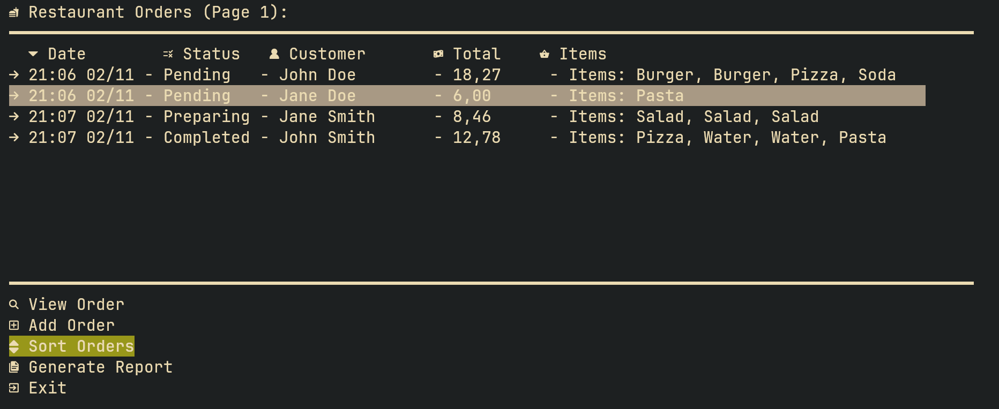
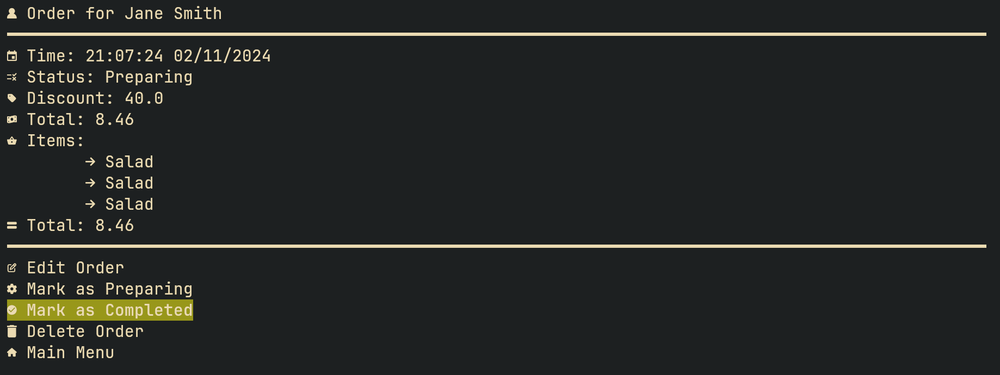

# mti-shell-order-management

A simple Java CRUD application for managing orders for a restaurant, built with [JLine](https://github.com/jline/jline3) for a shell environment. Orders and menu are stored in text and binary files. The project was created as part of my OOPP course.

## Preview

